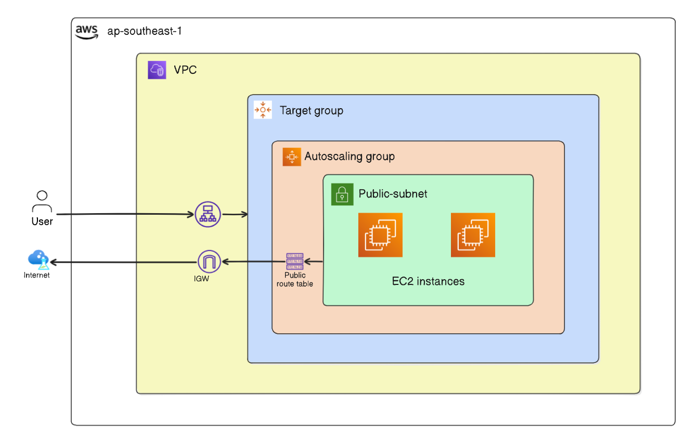

# AWS Autoscaling EC2 instance using Terraform
In this lab, you will learn how to set up Auto Scaling in AWS using Terraform. Auto Scaling is a crucial feature in AWS that automatically adjusts the number of EC2 instances in a group according to the demand. This ensures that your application can handle varying amounts of traffic without manual intervention, optimizing performance and cost.

An Auto Scaling Group (ASG) manages a collection of EC2 instances that are treated as a logical grouping for automatic scaling and management. ASGs help ensure that the correct number of Amazon EC2 instances are running to handle the load for your application.

# Task Description
In this lab, you will:

1.  Create a VPC in the ap-southeast-1 region with two public subnets.  
2.  Set up an Internet Gateway and associate it with a route table to enable internet access for the subnets.  
3.  Create a security group for the Load Balancer (ALB) and the instances.  
4.  Generate an SSH key pair for EC2 instances using the ssh-keygen command.  
5.  Create a launch template with user data to install Apache2 and serve a basic HTML page.  
6.  Set up a Target Group for the Load Balancer.  
7.  Create an Application Load Balancer (ALB) to distribute incoming traffic.  
8.  Set up an Auto Scaling Group (ASG) to automatically adjust the number of instances based on demand.  
9.  Deploy the infrastructure using Terraform and verify the setup with a load test script.  

ssh-keygen -t rsa -b 4096 -f ~/.ssh/web_key
